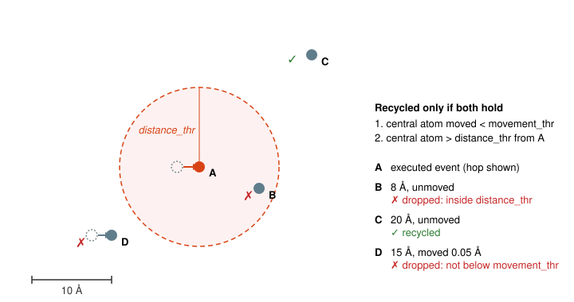

# Event Recycling

Event recycling settings are defined in the `[EventRecycling]` section of the input file.
The only required parameter is the `style` key, which selects the rule used to decide which active events survive from one KMC step to the next.
You must also enable recycling in the `[Control]` section.

Example:

```INI
[Control]
...
recycle = True
...

[EventRecycling]
style = displacement
movement_thr = 0.02
distance_thr = 10.0
```

`movement_thr` and `distance_thr` are optional; the values above are the defaults, in ångström.

*Note: currently only one recycling strategy is implemented (`style = displacement`).
The `style` key is intended for future rules (see [Extending](#extending)).*

---

## General Idea

At each step, pyKMC builds the active event table: every generic event whose environment ID is present in the system is refined for every atom carrying that ID, and the KMC selection is made from these refined (specific) events.
Without recycling, the active table is discarded at the end of the step and rebuilt from scratch at the next one, even though the executed event only changed the atomic positions in a small region of the system.

Event recycling keeps the specific events that the executed event could not have affected, so that the next refinement stage skips them.
It does not change the reference (generic) event table, the event searches, or the selection algorithm; it only decides which refined events are carried over.

With `style = displacement`, an active event is recycled when its central atom both

1. **did not move** during the executed event (displacement below `movement_thr`), and
2. **is far** from the executed event's central atom (distance above `distance_thr`).

Both distances are measured with the periodic minimum-image convention.
The first check catches atoms that were dragged along by the event.
The second check catches atoms that stayed put while their neighbours moved: the local environment of such an atom, and therefore its refined event, may have changed even though the atom itself did not.

<div style="text-align: center;">
  
  <div style="font-size: 0.9em; color: gray; margin-top: 5px;">
    The displacement rule after executing the event at A. B is unmoved but inside <code>distance_thr</code>, so it is dropped; C is unmoved and outside, so it is recycled; D is outside but its central atom moved, so it is dropped. Displacements are exaggerated.
  </div>
</div>

## Algorithm

At the end of each KMC step, once the selected event has been applied:

1. Take the snapshot of the atomic positions saved just before the event was applied.
2. Drop the executed event itself.
3. For every other row of the active table, compute the displacement of its central atom between the snapshot and the current positions. Drop the row if the displacement is `movement_thr` or more.
4. Compute the distance between the row's central atom and the executed event's central atom, both at their current positions. Drop the row if the distance is `distance_thr` or less.
5. The surviving rows stay in the active table. The log reports `N events flagged for recycling`.

At the next step:

1. New environments are searched as usual and their generic events are added to the reference table.
2. The refinement stage receives the `(atom, reference event)` pairs already present in the active table and skips them. Every other applicable event is refined. The log reports `Recycling N events from the previous step`.
3. The newly refined events are appended to the recycled ones, duplicates are removed, and the KMC selection proceeds on the combined table.

A recycled event keeps the saddle and final positions, the energy barrier and the rate computed when it was refined.
When it is selected, it is reconstructed on the current system like any other active event.

## Example

The scenario in the figure is the one used by the test suite (`tests/recycle/`): a 10×10×10 Ni FCC cell with vacancies whose events are centred on atoms A, B, C and D.
The event at A is executed with the default thresholds.

| Event | Distance from A | Central atom moved | Result |
|---|---|---|---|
| B | 8 Å | no | dropped: inside `distance_thr` |
| C | 20 Å | no | recycled |
| D | 15 Å | 0.05 Å | dropped: displacement is not below `movement_thr` |

Raising `distance_thr` to 25 Å would drop C as well; nothing would be recycled and the next step would refine every event, exactly as with `recycle = False`.

## Choosing the thresholds

### `movement_thr`

The default of 0.02 Å is far below the displacement of any atom that takes part in an event, and above the small relaxation shifts of atoms that merely settle around it.
There is rarely a reason to change it.

### `distance_thr`

`distance_thr` stands in for the *perturbation radius* of an event: the distance beyond which executing the event leaves the local environments of other atoms, and hence their refined events, unchanged.
pyKMC does not measure this radius.
It depends on the material, the potential and the kind of defect: an interstitial has a longer-ranged strain field than a vacancy, and surface or grain-boundary events relax over larger distances than bulk ones.

**A too-small `distance_thr` is a silent error.**
An event whose central atom lies beyond the cutoff but whose environment was nevertheless perturbed is kept with its stale barrier and positions.
No error is raised, the run continues, and the recycled event is simply wrong when it is selected.
A too-large cutoff only costs refinement time, so err on the large side.

As a rule of thumb, `distance_thr` should be at least `rcut` (from `[AtomicEnvironment]`) plus the radius of the region that moves during the event: any atom within `rcut` of a moved atom sees a changed environment.
The default of 10 Å is about 1.5 × the usual `rcut` of 6.5 Å and is meant for vacancy-type events in bulk metals.
Increase it for interstitials, for collective events that move many atoms, or whenever refinement is cheap compared with the risk.

To check a cutoff, run the same system with `recycle = False` (or with `distance_thr` doubled) for a comparable number of steps and compare the barriers of the executed events and the total energies reported in the KMC log.
Because event selection is stochastic, the two runs follow different trajectories: compare the distributions over many steps rather than step by step.
Barriers or energies that only the recycled run produces mean that stale events are being selected and the cutoff must be raised.
The two log lines quoted above tell you how much refinement work a given cutoff saves.

## Interactions with other features

- **Basins.** When the selected event triggers a basin super-event, recycling is suspended for that step: the super-event moves many atoms, so the active table is cleared entirely and the next step refines everything. Recycling resumes on the following ordinary step.
- **Active volumes.** Recycling applies no special handling to active volumes; recycled rows are used as they are. This combination has not been validated.
- **Reconstruction.** A recycled event is reconstructed at selection time like any other active event. A failed reconstruction is handled exactly as for a freshly refined event: it is logged, the active event is removed, the selection is repeated, and the underlying reference event is dropped from the catalogue.

## Extending

Recycling strategies live in `pykmc/event_recycling.py` (see the [API reference](api/event_recycling.md)).
To add one:

1. Subclass `Recycling` and implement `select_recyclable(active_table, executed_idx, system, positions_pre)`. It must return the subset of `active_table.table` to carry over (an empty DataFrame recycles nothing) and must not include the executed row.
2. Add the new name to the `style` literal of `EventRecyclingConfig` in `pykmc/config.py`, together with any parameters the rule needs.
3. Instantiate it in `KMC.__init__` (`pykmc/kmc.py`) when `config.eventrecycling.style` matches.

The recycler is attached to the `ActiveEventTable` once and is called from `prune_for_recycling` at the end of every step; nothing else in the loop needs to change.
